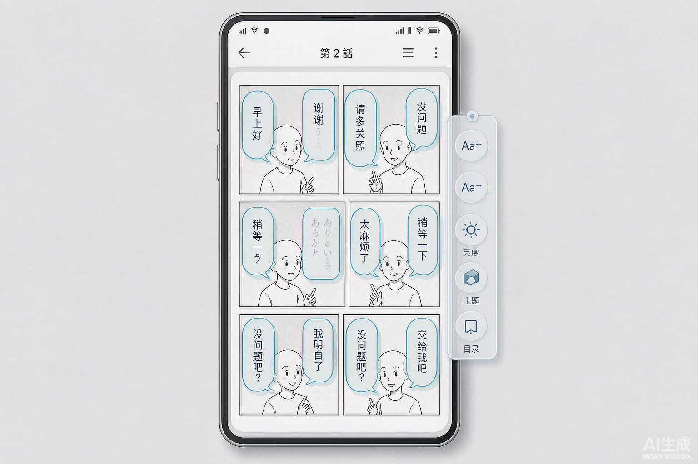
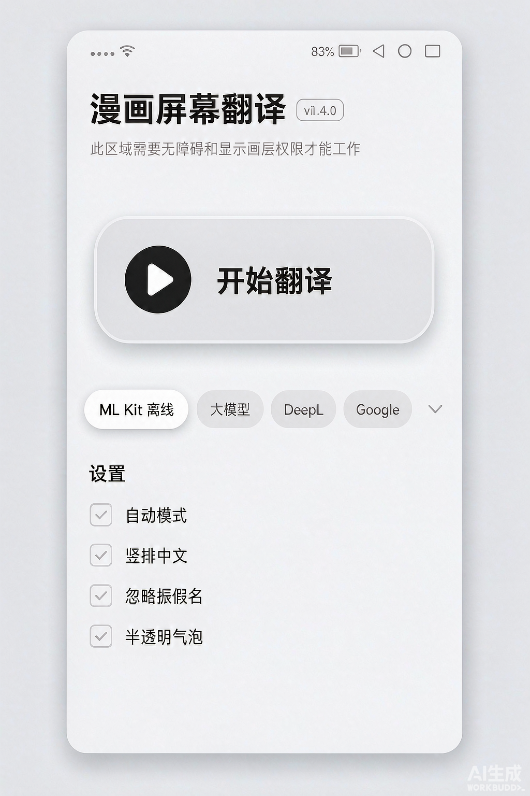
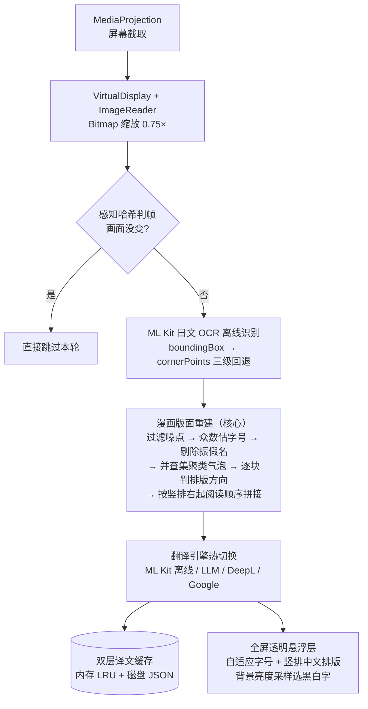

# 漫画屏幕翻译 (Manga Screen Translator)

Android 端「屏幕翻译」应用，专门针对**日文漫画**优化：实时识别屏幕上漫画气泡里的日文，
就地把译文绘制回气泡原位。工作在任何漫画阅读器之上，不需要漫画源文件。

**日文 → 简体中文 · 默认完全离线 · 免费 · 无需 API Key**

| | |
|---|---|
| 状态 | v1.4.0（versionCode 43），release 正式签名 |
| 规模 | 39 个 Kotlin 文件 / 约 9,300 行代码，单人独立开发 |
| 引擎 | ML Kit 端上离线（默认）/ OpenAI 兼容大模型 / DeepL / Google Cloud Translation |
| 最低支持 | Android 8.0（API 26），targetSdk 35 |

> 本仓库是**作品集展示仓库**，只包含项目文档与构建配置，不含源码。详见文末说明。

---

## 效果概览

| 翻译覆盖效果 | 应用主界面 |
|---|---|
|  |  |

> 以上为 **AI 生成的概念示意图**（用于展示交互形态，非真机截图）。译文按气泡形状就地覆盖，竖排气泡的译文同样竖排。

### 核心特性

- **气泡级版面重建** —— 不是整页 OCR 塞给翻译，而是先把页面还原成「一个个气泡、按日漫阅读顺序排列的一句话」，再逐气泡翻译
- **就地覆盖排版** —— 译文按气泡尺寸自适应字号；竖排气泡输出竖排中文；按气泡底色自动选黑字或白字
- **四级 OCR 回退** —— 轴对齐框 → 角点外接框 → 元素框并集，专治 ML Kit 对竖排日文返回空矩形的问题
- **4 种翻译引擎热切换** —— 离线 / 大模型 / DeepL / Google，切换即生效
- **离线开箱即用** —— ML Kit 日文 OCR 与翻译模型全部预置进 APK（为此自己打通了模型内置方案），装上就能用，地铁上也能用
- **帧级去重 + 双层缓存** —— 8×8 感知哈希判帧 + 内存 LRU + 磁盘 JSON，同一页停留再久也不会重复计算
- **Pro 能力已落地** —— 术语库、作品档案、离线授权码（非对称签名，无服务端），具备完整商业化能力

---

## 工作原理



整条管线运行在一个前台服务内，自动模式下每 1.5 秒一轮；上一轮未结束时用 `tryLock` 直接跳过本轮，避免延迟累积。

---

## 核心技术难点

通用 OCR + 翻译 API 拼起来做不出能用的漫画翻译。真正的难点在**版面重建**：

| 难点 | 现象 | 解法 |
|---|---|---|
| **竖排右起** | 日漫对话竖排，一列一字从上往下、多列从右往左。按 y 坐标排序会把不同列串在一起，译文彻底乱掉 | 每个聚类块按行框形状投票判方向；竖排按「列号降序 → 列内自上而下」排序 |
| **旋转文本的框是空的，不是 null** | ML Kit 对竖排日文常判定为「旋转文本」，`getBoundingBox()` 永不返回 null，但给的是 `(0,0,0,0)` 空矩形——只判 null 判不出来，空框一路通过后译文无声消失，现象是「竖排气泡一处译文都没有」 | 三级回退取框：轴对齐框 → 角点外接框 → 元素框并集；**空框与 null 框一视同仁** |
| **振假名** | 汉字旁的注音小字被 OCR 当成独立文本行，译文里混进「かんが」 | 字号基准取**众数**（对少数大字号 UI 文本更稳健），小于 0.62 倍且紧贴更大行才判定为振假名 |
| **气泡切分** | 同一气泡里 2~3 列必须合成一句话翻译；不同气泡必须分开 | 并查集按物理间距聚类：x/y 双向间距都小于阈值（默认 1 字宽）才合并。真机实测气泡净间隙 49~266px，远大于阈值，区分度充足 |
| **译文长度不匹配** | 日文 8 字，中文可能只有 5 字，而气泡尺寸固定 | 对字号做**二分查找**，求「能塞进气泡的最大字号」；竖排气泡把中文也竖排 |
| **重复计算** | 自动模式每 1.5 秒一轮，同页停留 30 秒 = 20 轮全量 OCR | 8×8 感知哈希判帧 + 双层缓存，画面没变直接 return |

### 几个刻意的设计取舍

- **截屏、OCR、翻译、悬浮窗全在一个 Service** —— MediaProjection 的授权 token 绑定在创建它的组件上，拆成多服务后分辨率、旋转、投影生命周期都要跨组件同步，还要处理任意一方被系统杀掉的情况。一个服务持有全部状态，推理成本最低；拆分边界已预留。
- **SharedPreferences 而非 DataStore** —— 截屏循环每 1.5 秒要**同步**读一次配置（后台线程）。SharedPreferences 有内存缓存，读是 O(1) 不阻塞；DataStore 只能异步读，会把热路径变成 suspend 调用。对外暴露 `StateFlow`，将来切换只改一个文件。
- **管线 `tryLock` 而非 `lock`** —— 自动模式下上一轮没跑完就直接跳过本轮。排队只会让延迟越积越大，屏幕上出现的还是好几秒前的结果。
- **离线模型打进 APK** —— ML Kit 官方只给 OCR 提供内置版本，翻译模型必须首启联网下载。把模型预置进 assets、运行时装到 ML Kit 认的目录，彻底消除首次下载失败这个最大的可用性风险，代价是 APK 增大约 80MB（en_ja 45.8MB + en_zh 33.7MB）。

---

## 技术栈

| 层 | 选型 |
|---|---|
| 语言 / UI | Kotlin + Jetpack Compose（Material 3，明暗主题） |
| 架构 | 单前台服务管线 + StateFlow 状态共享 + 协程 |
| OCR | ML Kit Text Recognition Japanese（离线，含竖排支持） |
| 离线翻译 | ML Kit On-device Translate（模型内置 assets） |
| 在线翻译 | OpenAI 兼容端点（DeepSeek / 通义 / Kimi / Ollama 均可）、DeepL API、Google Cloud Translation v2，共享 OkHttp 客户端 |
| 截屏 | MediaProjection + VirtualDisplay + ImageReader，Android 14 旋转适配 |
| 构建 | AGP + Gradle 8.9（Kotlin DSL），R8 压缩 + v2 签名 |
| 工程化 | 构建配置、签名配置、依赖版本均见本仓库 `build.gradle.kts` 系列（不含源码） |

## 工程配置（本仓库包含）

```
├── build.gradle.kts            根构建脚本
├── settings.gradle.kts
├── gradle.properties
├── gradle/wrapper/gradle-wrapper.properties
└── app/
    ├── build.gradle.kts        SDK 版本、签名、R8、依赖清单
    └── proguard-rules.pro      ML Kit / OkHttp / Compose 混淆补充规则
```

---

## 下载安装

从 [**Releases**](../../releases) 下载 APK，拷进手机安装（需允许「安装未知来源应用」）：

| 文件 | 大小 | 适用 |
|---|---|---|
| `MangaScreenTranslator-arm64-release.apk` | ~111 MB | **推荐**。近五年所有真机（骁龙/天玑/麒麟均为 arm64） |
| `MangaScreenTranslator-universal-release.apk` | ~184 MB | 模拟器 / 老 32 位机 / 不确定架构 |

体积中约 80MB 是预置的离线翻译模型 —— 这是「装上即可离线用」的代价。

### 使用流程

1. 授予悬浮窗、通知、屏幕录制三项权限
2. 打开任意漫画阅读器 → 点悬浮球启动翻译
3. 拖框选中漫画正文区域（排除阅读器 UI，对识别质量提升最明显）
4. 自动模式下每 1.5 秒刷新一轮；横竖排、字号、气泡样式均可在设置中调

## 已知限制（节选）

- 无法截取 `FLAG_SECURE` 画面：部分正版漫画 App 设置了该标志，系统层面禁止截取，属系统限制而非 bug
- ML Kit 离线翻译质量有限：长句、敬语、双关偏生硬，且日译中需经英语中转（ML Kit 无 ja→zh 直连模型）；追求质量请切大模型引擎
- 过小的文字（< ~9px）被主动过滤：翻译价值低、误识别率高，属有意设计

---

## 关于本仓库

这是 MangaScreenTranslator 的**作品集展示仓库**，用于简历 / 作品集引用：

- **包含**：项目文档、架构说明、技术难点解析、构建配置
- **不包含**：应用源码 —— 完整源码保存在私有仓库中

如需交流实现细节或查看源码，欢迎通过 GitHub 联系。
